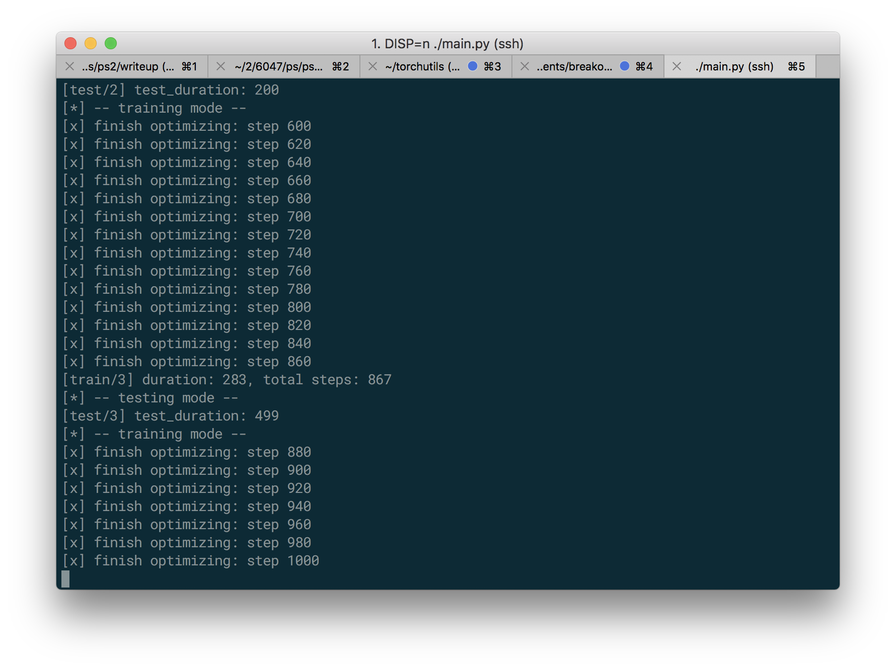

# Breakout

## About
This is an implementation of the Deep Q-Network introduced by Google DeepMind using PyTorch.
The network consists of three convolutional layers and two feed-forward layers, with experience replay for stabilized training.
One of the most novel features of the papers is **Experience Replay**, which essentially consists of a ring buffer of transitions that is sampled from when training the model in order to decouple action values with time.

The paper and overview can be found at the following links:
* Overview:
https://deepmind.com/research/publications/playing-atari-deep-reinforcement-learning/
* Paper: 
https://arxiv.org/pdf/1312.5602v1.pdf


## Screenshots



## Required dependencies
* `torchutils`

## Running the model
```bash
DISP=N ./main.py # no dashboard display
DISP=Y ./main.py # with dashboard display
```
